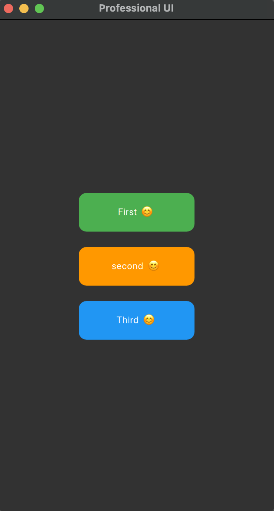

# Day 01 – QML Buttons Layout UI

This is a simple Qt Quick (QML) project demonstrating how to design interactive buttons with layout alignment and click events.

---

## 📋 Features

- 💡 Built with QML and Qt Quick Controls 2
- 📐 Uses ColumnLayout for clean vertical alignment
- 🎨 3 rectangular buttons with custom colors:
  - 🔵 Blue button labeled "First 😊"
  - 🟢 Green button labeled "Second 😊"
  - 🟠 Orange button labeled "Third 😊"
- 🎯 Clickable buttons with MouseArea and console logging

---

## 📸 Screenshot

Below is a preview of the UI:

---

## 🚀 How to Run

1. Open the project folder in Qt Creator
2. Make sure you have Qt 5.15 or 6+ installed with QML support
3. Run the project (`▶️`) or press `Ctrl + R`
4. Open the “Application Output” tab to see logs like:
    Clicked First
    Clicked Second
    Clicked Third
